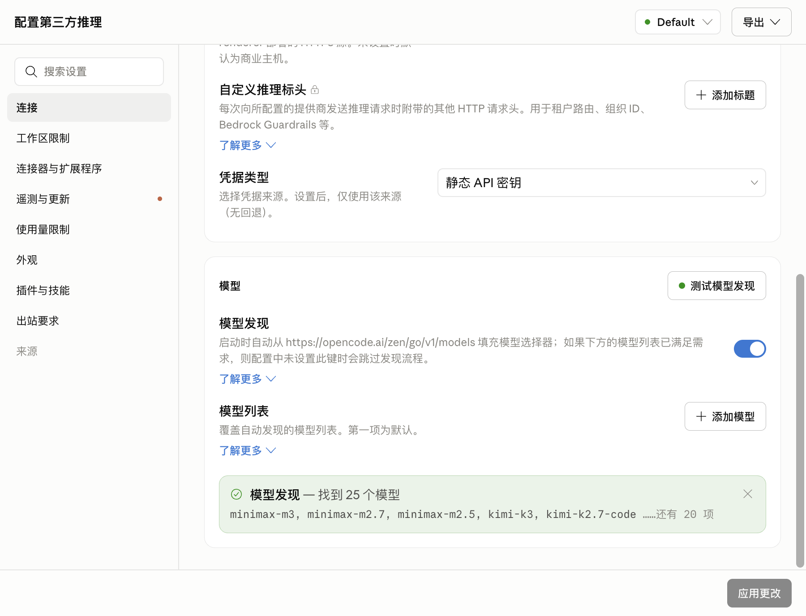

# Claude Desktop 中文本地化&Gateway原生适配主流API

为 Claude Mac 桌面应用提供简体中文和繁体中文翻译，并附带模型映射与运行修复。

基于版本：Claude Desktop 1.26832.0（2026-08-09 汉化）



## 安装

AI Agent 自动化安装：根据 llms.txt 汉化本地 Claude Desktop。

版本更新过快，手动安装难以跟进，补丁全部由 AI Agent 自动完成。

## 功能

- 全量汉化：Electron 原生界面、Web UI、系统菜单，简体 + 繁体
- 模型映射：自动拉取主流模型配置，映射上下文长度与思考强度档位
- 运行修复：语言白名单、模型发现恢复、钥匙链弹窗消除

## 目录结构

```
data/    翻译数据与模型映射
scripts/ 汉化与模型映射脚本
llms.txt AI Agent 操作指南
```

## 翻译规范

简体用大陆术语，繁体用台湾术语；品牌名与技术词保持英文；ICU 语法、HTML 标签、变量插值原样保留。
